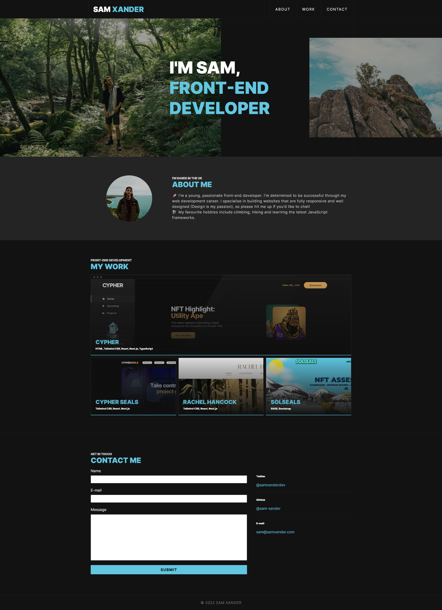

# Portfolio

### View project [here](https://sam-xander.github.io/portfolio/)

The brief for this project was to use semantic html, and custom css to create a personal portfolio page to showcase my work.

I started creating a mock-up to reference while coding. You can see the original Adobe XD mock-up [here](https://xd.adobe.com/view/c7abe039-2624-41c5-8c9c-f5faddad9552-92f8/?fullscreen). Then I started building each component, and afterwards applied some minor refactoring to the code to make it optimised and easily scalable.

